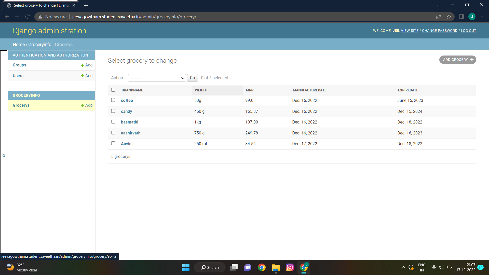

# Django ORM Web Application

## AIM
To develop a Django application to store and retrieve data from a database using Object Relational Mapping(ORM).

## Entity Relationship Diagram

Include your ER diagram here

## DESIGN STEPS

### STEP 1:

### STEP 2:

### STEP 3:

Write your own steps

## PROGRAM

'''
from django.db import models
from django.contrib import admin

# Create your models here.
class Grocery(models.Model):
    brandname = models.CharField(max_length=100,primary_key= True)
    weight = models.CharField(max_length=100)
    mrp= models.CharField(max_length=80)
    manufacturedate = models.DateField()
    expiredate = models.DateField()

    
class GroceryAdmin(admin.ModelAdmin):
    list_display = ('brandname','weight','mrp','manufacturedate','expiredate')
'''

## OUTPUT

 

## RESULT
